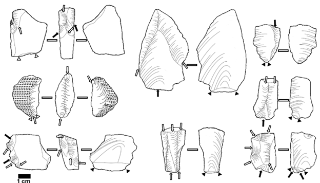
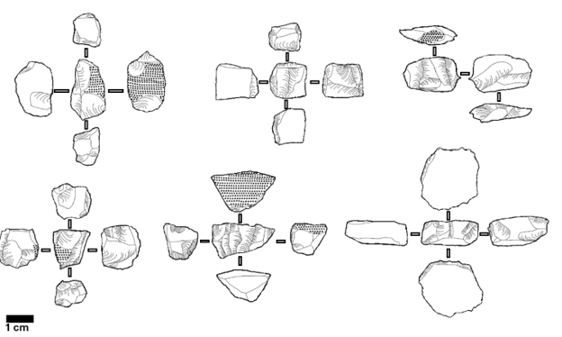
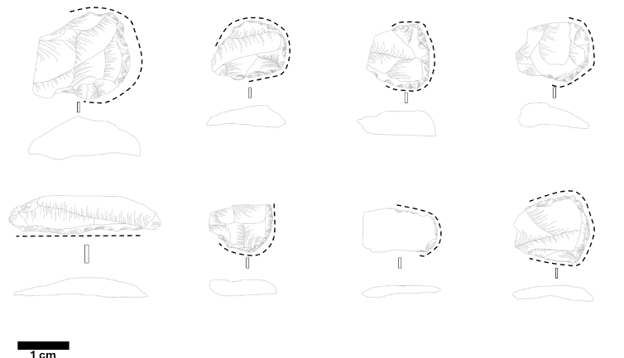
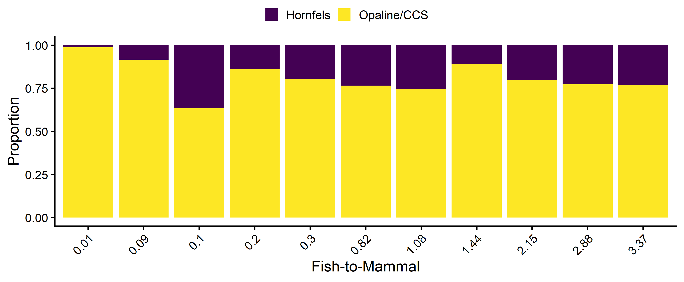
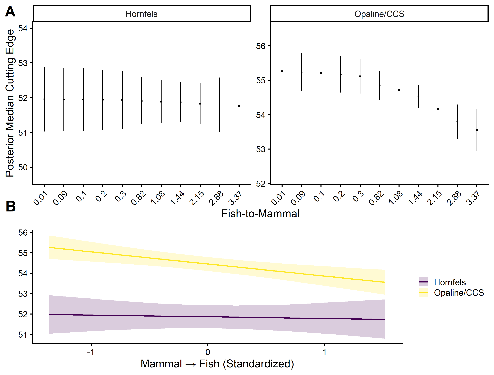
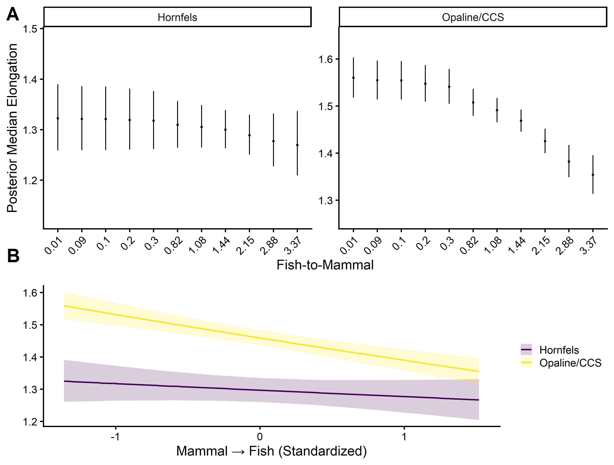
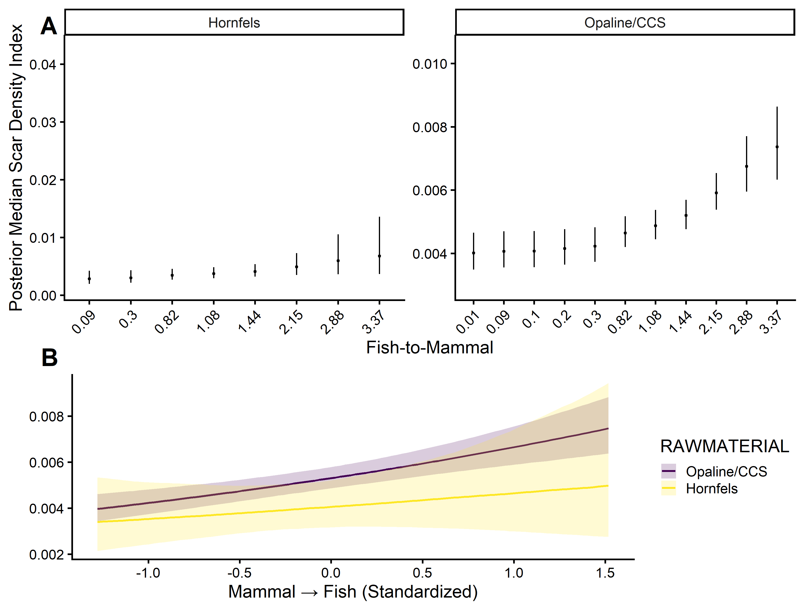
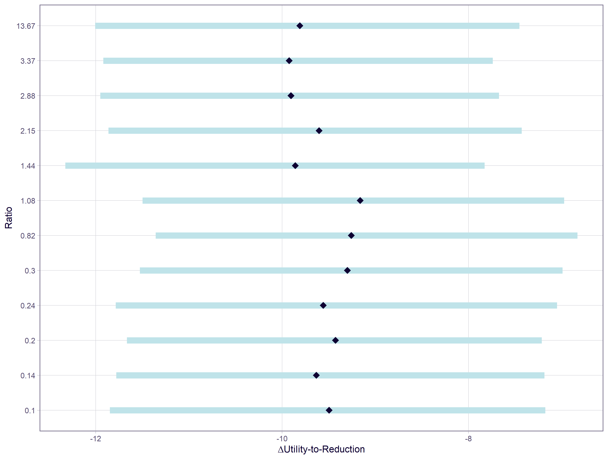

# Late Holocene riverine resource intensification and its effect on hunter-gatherer technological strategies at Likoaeng, Lesotho

## Folder structure

- `data/`: contains input data for all R quarto documents
- `code/`: all analysis scripts required to re-run the project provided as quarto documents
- `results/`: figures, tables, and other output files produced inside and outside R

## Instructions to reproduce this study
To reproduce this study, please pull this repository into a new R project and restore the environment via _renv::restore()_ install _renv_ if not installed already. This will load the package versions used during this study. You can then render each of the files in the _'code'_ folder. This will run the script and export the figures according to this repository's folder structure (_'/results/figures'_). The images are already provided in _'results/figures'_ directory. The quarto documents will also pull the data in according to this repository's folder structure (_'/data'_), which take the form of comma-separated-values and one xlsx file with multiple saved sheats.

## Overview
This is a multivariate project that examines whether hunter-gatherer technological strategies changed when they increased shellfish consumption at Steenbokfontein Cave. I use Bayesian models to evaluate the relationship of several stone tool variables including utility, length, mass, and raw material. I use gt_summary and ggplot2 to develop publish-quality tables and figures.

I first describe the composition of hunter-gatherer toolkits, including the raw stone material, types, and frequencies of their stone technology. I describe these data in tabular and graphical representations. I then construct a Bayesian model with catgeorical and Bernoulli families to evaluate whether there are significant trends in raw material and toolkit composition as hunter-gatheres focused on coastal resources.

I then evaluate three specific artifact classes most commonly found in archaeological contexts to evaluate whether there are technological shifts sensitive to increased coastal resource exploitation. Namely, I examine stone flakes, cores, and scrapers. I use attributes I recorded from the tools to evaluate shifts in tool utility, reduction, and retouch intensity. To do this, I modeled several Bayesian GLMs composed of simple, hierarchical, and second order polynomials. I then evaluate which model fit the data best using a leave-one-out analysis. I then visualize and compute the rate of change between tool utility, reduction, and retouch intensity for the three stone tool classes.

**Flakes**
 

**Cores**

**Scrapers**

## Hypothesis
I expect shifts in toolkits as hunter-gatherers increased coastal resource use. If my models show significant shifts in toolkit composition and rates of change between tool utility, reduction, and retouch intensity, then there is evidence to support this hypothesis.

## Results

### Toolkit Composition
Though there are visible trends in toolkit and material composition (**Figure 1**), a proportional model conducted with a categorical and bernoulli family show no significant differences. This contradicts previous observations that predicted hunter-gatherer toolkits shift in response to changing mobility and dietary patterns.

### Flaked tools
There are clear trends in how hunter-gatherers managed their flaked tool cutting edge (**Figure 2**) and elongation, or how blade-like, the tool is (**Figure 3**) as they increased coastal resource use. **Figure 2a** shows a boxplot for the relationship between raw material (*hornfels* and *Opaline*) and fish-to-mammal ratios and **Figure 2b** shows the linear relationship between the same variables and a scaled fish-to-mammal ratio, As hunter-gatherers increased fish consumption, there was no change in hornfels (P(hornfels > 0) = 0.4) but a significant decrease in opaline cutting edge (P(Opaline > 0) = 0). The analysis of variance, shows that opaline only differs once hunter-gatherers crossed a threshold of 1:1 consumption of fish and mammal. **Figure 3** shows the same relationship associated with flake elongation. These data suggest that flaking technology did not change until fish became the dominant source of food in hunter-gatherer diets.

### Core tools
Similar to the stone flakes, **Figure 4** shows the relationship between core scars-to-surface area and fish-to-mammal ratios. Also, like the flaked tools, opaline shows a significant increase in the use of cores' surface area (scar density) as hunter-gatherers focused on fish resources (P(Opaline > 0) = 1). There is also evidence that this increase use does not happen until fish become a dominatn food source in hunter-gatherer diets.

### Scrapers
There are no visible trends in how hunter-gatherers managed scraper utility and retouch intensity as they increased fish use (**Figure 5**).

## Conclusion

## Tools Used
- 'R'
- 'tidyverse', 'ggplot2', 'gt', 'brms'
- Quarto

## Author

Alex Gregory

PhD Candidate | Quantitative Analyst | Data Scientist | Bayesian | Archaeologist

arg9496@nyu.edu
